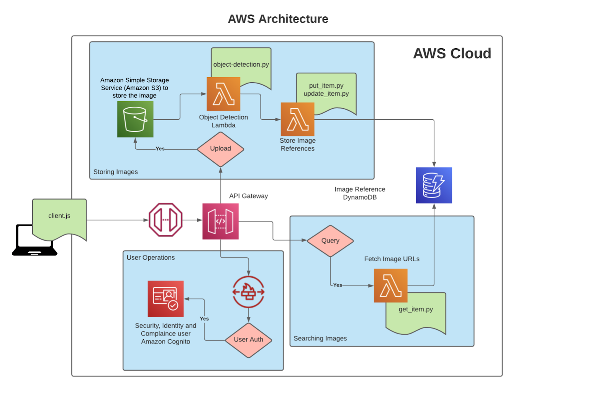

TagTag: A Modern Image Storage on the Cloud

Image-search-engine aims at developing a cloudified solution using AWS where a user uploads images and can retrieve the URLs of the images by specifying the tags(objects detected from the images) using AWS services such as Simple Storage Service (S3), Lambda, API Gateway and Cognito

- [Github Repo](https://github.com/yohanderose/Image-Search-Engine.git)




## Dependencies 🐳

- AWS account

## AWS Services

- S3
- DynamoDB
- Lambda
- Cognito
- API Gateway

## Usage ️️️️️️️️️⚙️

```bash
git Git clone https://github.com/yohanderose/Image-Search-Engine.git
cd Image-Search-Engine
```
- [Frontend UI]

### Sign-up to register to the system 

